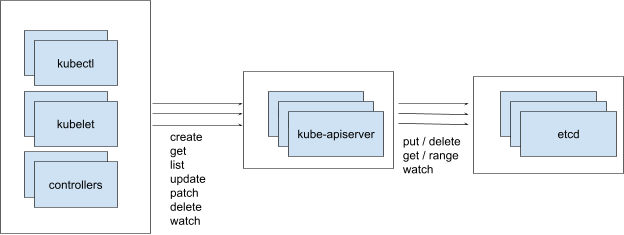
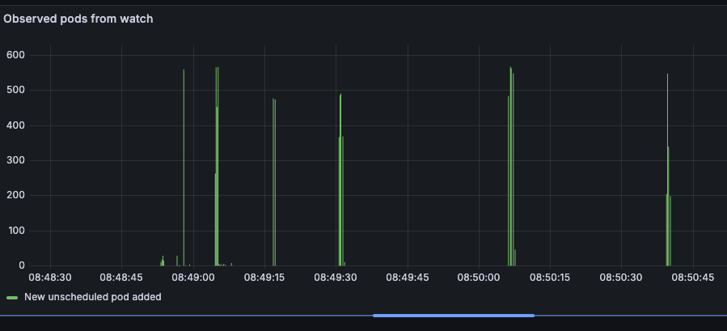
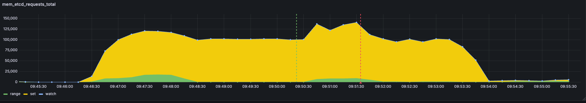

:source-highlighter: rouge
:toc:
:toclevels: 5
:toc-placement!:
= k8s-1m Overview

This is an effort to create a fully functional Kubernetes cluster with 1 million active nodes.

ifdef::env-github[]
:tip-caption: :bulb:
TIP: A nicer formatted version of this doc is available at https://bchess.github.io/k8s-1m/
endif::[]

toc::[]

== Why?

Several years ago at OpenAI I helped author https://openai.com/index/scaling-kubernetes-to-7500-nodes/[Scaling Kubernetes to 7500 Nodes] which remains one of the CNCF's most popular blog posts. Alibaba made a https://www.alibabacloud.com/blog/how-does-alibaba-ensure-the-performance-of-system-components-in-a-10000-node-kubernetes-cluster_595469#:~:text=Through%20a%20series%20of%20enhancements,nodes%20in%20a%20single%20cluster.[post] about running Kubernetes clusters with 10K nodes. Google made a https://cloud.google.com/blog/products/containers-kubernetes/google-kubernetes-engine-clusters-can-have-up-to-15000-nodes[post] about 15K nodes with Bayer Crop Science. Fast forward to today, GKE supports running some clusters up to https://cloud.google.com/kubernetes-engine/quotas#limits_per_cluster[65K nodes], and AWS recently https://aws.amazon.com/blogs/containers/amazon-eks-enables-ultra-scale-ai-ml-workloads-with-support-for-100k-nodes-per-cluster/[announced] support for clusters up to 100K nodes.

In online forums and in my own conversations with peers, I've encountered a lot of debate about how big a Kubernetes cluster can get.  What tends to be lacking from these discussions is hard data and evidence-backed justifications. I've worked with engineers reluctant to push things beyond what they've seen before because they're fearful or uncertain of what may go wrong. Or when something does go wrong, the response is to scale down the cluster rather than understand and address the bottleneck.

The spirit of the k8s-1m project is to identify the hard blockers to scalability. What are the actual limits of how hard a particular system can be pushed, and why are those the limits? What would it take to overcome those limits to make the system even more scalable? What types of workloads can be run at greater scale than others?

Many limitations are imposed by software. As software engineers, it's on us to work through those limitations. Once we've done all we can on the software side and the remaining bottlenecks are in hardware, only then should we wait on next generation hardware to achieve our goals.

I don't have ambitions to commercialize this effort. Certainly not as-is. I'm fine making the code freely available. Realistically, while all of the claims and results in this project are true and verifiable, each large-scale Kubernetes cluster has its own unique workload demands that may or may not work well with this design. So I wouldn't classify this as "production-ready" or recommend that anyone use it for mission-critical workloads.

At the same time, I hope that the proposed designs here inspire the Kubernetes community with what is possible and influence the future roadmap of the project.

== Components

Early on in this project, I asked ChatGPT "`I want to scale Kubernetes to 1 million nodes. What types of problems would I need to overcome?`"

Here's a portion of what I got:

[.excerpt]
____
Scaling Kubernetes to 1 million nodes is a formidable challenge and involves overcoming a variety of technical hurdles. Here are the key areas you would need to address:

*etcd Scalability and Performance*: etcd is the backbone of Kubernetes' storage, handling all API object data. With 1 million nodes, the volume of data managed by etcd will increase significantly. Optimizing etcd's performance, including efficient data partitioning, tuning the database to handle high loads, and possibly looking into alternatives or supplements to etcd for certain types of data, is crucial.

*kube-apiserver Performance*: The Kubernetes kube-apiserver would face enormous loads in a cluster of this size. Optimizing its performance includes horizontal scaling (running multiple kube-apiserver instances), rate limiting, and efficient caching mechanisms. Also, minimizing the watch events and reducing the overall number of requests to the kube-apiserver is important.

*Networking*: Handling network traffic for 1 million nodes is extremely challenging. This includes the management of IP addresses, efficient routing, and possibly segmenting the network to prevent it from becoming a bottleneck. Solutions like Cilium, which uses eBPF technology for networking and security, might be necessary.

*Scheduling and Resource Management*: The scheduler will have increased latency as it tries to place pods optimally across a vast number of nodes. Enhancing the scheduler to handle large scale operations efficiently, possibly by implementing custom schedulers for specific tasks, is required.
____

It goes on to list other challenges, including Logging & Monitoring, Security, and Storage management.

I think these first items are the most critical. There are a wide range of options for support for logging or PVCs, but if you can't run etcd or schedule pods or have the pods talk to one another, you're not getting anywhere.

Below I'm going to discuss the three major areas I tackled.

=== Networking

The common challenges with networking in Kubernetes are IP address space, service discovery, and network policies (aka firewalling). Compared to later challenges, configuring networking to support 1M nodes turned out to be relatively easy.

==== Pod IPs

It can be a challenge to plan IP address space in large clusters. Efficient routing usually means routing a contiguous CIDR to each individual node, which means you're pre-allocating how many IP addresses (and thus pods) each node can serve. Some nodes that are intended for lots of small workloads end up constrained by the number of available IP addresses before they run out of other hardware resources. A 10.0.0.0/8 has 16 million IPs. For a 1-million node cluster, that leaves just 15 pod IPs per node, which is likely not enough.

The answer is to use IPv6 thoroughly and exclusively. The enormous IPv6 address space means that there's plenty of room for every pod to have its own globally accessible IP address.

Kubernetes has great support for IPv6, and it requires no code changes to create a fully functioning Kubernetes cluster that uses IPv6 exclusively.

My goal is for each node to have an IPv6 address prefix with a range large enough so each pod on that node can have its own IP out of that range. Plus, of course, at least one for the host itself.

Of course, using IPv6 requires support from your compute vendor. All of the major cloud providers (and even many less-major) support IPv6 to some degree or another. And with public IPv6, it's trivial to create a single cluster that spans multiple clouds.

I primarily focused on AWS, GCP, and Vultr. (Scoff if you want at Vultr, but they have cheap compute and I am self-bootstrapping this project.) But each one has slightly different twists on its support for IPv6 addressing inside a VM. To give a sense of the range of situations, let me briefly describe each below:

*Vultr*: Each node gets a /64. The primary IP of the node is the ::1 of that range, and the server automatically receives all traffic for any IP in the full /64 range.

*GCP:* Each node gets a /96. The primary IP of the node is some random IP within that range. The server must send valid NDP RA packets for the IPs that it wants to receive traffic for.

*AWS:* Each node gets a /128. You can add a /80 prefix (that comes from a different range) via an API call to an existing NIC or VM. (The '`Create`' API looks like it can support setting both an IPv6 address and an IPv6 range at creation time, but you'll get an error). The server must send valid NDP RA packets for the IPs it wants to receive traffic for, and all outgoing packets must use the one MAC address that matches the primary IP.

To satisfy the intersection of these requirements, particularly the requirement about MAC addresses, I create one bridge for all of the pods' interfaces to share. But leave the host interface separate, and enable forwarding to handle traffic between the bridge and the host interface. A host-local IPAM is set to a /96 IPv6 prefix of what I get from the provider. This gives us a full 2^32 IPs per node, plenty of space for pods.

Because these are global public IPv6 addresses, no special routing is necessary. No packet encapsulation or NAT is used. Traffic from each pod is correctly sourced from its true origin pod IP, regardless of destination.

==== IPv4-only external service dependencies

If you only have an IPv6 address, then you can only reach other IPv6 addresses on the internet. Anything that is IPv4-only isn't directly accessible.

Most services I used in this project worked fine: Ubuntu packages, PyPi packages, the docker.io registry. The main exception was GitHub. Github.com remains stubbornly IPv4-only. Tsk tsk.

Many AWS services have dual-stack endpoints but notably for this project Elastic Container Registry (ECR) does not. Tsk tsk to them as well.

For IPv6 devices to reach IPv4 hosts, most cloud providers offer some sort of NAT64 gateway. You can also roll your own gateway on a Linux VM. I over-engineered this a bit with a custom WireGuard server. All VMs connect via WireGuard to this server and use it as an IPv4 gateway.

==== Network Policies

High-level, I hand-waved over this problem and did not use network policies between workloads.

1 million nodes would have 1 million separate IPv6 prefixes, which is far too many individual entries for any firewall solution to support. Security-minded folks: clutch your pearls when I say that I do not use extensive firewalling to prevent access into the cluster from the Internet. I _do_ use firewall rules to limit to a select few number of ports that I know need to be reached, but otherwise we must rely on other techniques to safeguard unauthorized inbound access to servers and pods.

Thorough use of TLS covers most use cases for this project. The enormous size of the IPv6 address space also makes scanning impractical. Cilium, kube-proxy, or other network plugins could also limit which pods can reach which pods, but at significant cost of additional watches on the control plane.

If you're using one single vendor for all of your nodes, it may be plausible that all nodes still get ipv6 ranges out of 1 or a few larger spaces, a count low enough that could be reasonably installed as firewall rules.

==== Network flow needs (# of TCP connections)

Both kube-apiservers and etcd support both HTTP/2 and gRPC. Many individual requests and streams are multiplexed over a single TCP connection. Kubernetes sets a default HTTP/2 limit of 100 concurrent requests (or technically streams) per TCP connection. (HTTP/2 can support far more than that, but as you add more streams you run into performance problems like https://en.wikipedia.org/wiki/Head-of-line_blocking[head-of-line blocking]). So each kubelet needs at least 1 connection to the kube-apiserver control plane. And you can expect 1 more connection for kube-proxy, or any similar CNI like Cilium or Calico.  With 1M nodes, that means each kube-apiserver is supporting at least 2 million TCP connections. With 8 kube-apiservers, each server would be supporting 250K connections to kubelets.

Linux itself can support this number of connections with some light tuning. And of course make sure you have allowed yourself enough file descriptors. Nevertheless it may be more than your network provider can support. Azure, for example, documents that it can support a maximum of 500k inbound and 500k outbound connections per VM. GCP and AWS do not publish limits, but there _are_ limits in any system to both the total number of concurrent connections as well as the _rate_ of new connections being made.

=== Managing state

When I talk about “managing state,” I mean the API surface that Kubernetes exposes for interacting with resources. With careful tuning, the kube-apiserver can scale to sufficiently high levels of throughput. etcd, however, is the bottleneck. In this section, I’ll outline why that is and describe a replacement implementation that can meet the demands of a million-node cluster.

==== kube-apiservers vs etcd

First a quick overview about the ways you work with state in Kubernetes. Any number of clients interact with kube-apiservers, which then in turn interact with etcd.

kube-apiservers are stateless. etcd is the persistent store for all of Kubernetes resources. All CRUD operations you send to a kube-apiserver are actually persisted by etcd.

kube-apiservers have seven common verbs for state:

* `create`
* `get`
* `list`
* `update` (aka `replace`)
* `patch`
* `delete`
* `watch`

etcd has four:

* `put`
* `range` - includes `get` with a null `range_end`
* `deleteRange`
* `watch`

kube-apiserver `create`, `update`, `patch`, and `delete` all result in an etcd `put` operation. (A `delete` is just a `put` with a null value). etcd doesn't support any partial updates of values, only putting the entire value. So all operations that involve modifying a resource result in a new etcd `put` of the entire resource contents.

kube-apiserver `watch` can, but often doesn't, result in an etcd `watch`. More on that below.

==== Meeting the QPS needs for a 1M node cluster

Kubelets interact with the kube-apiserver primarily through two resource types:

* `Node` - the resource representing a server for running pods
* `Lease` - a lightweight heartbeat object updated by `kubelet` to signal liveness

The Lease is critical: if it isn't refreshed in time, the NodeController marks the node as `NotReady`. By default, each kubelet updates its `Lease` every 10 seconds. At a scale of 1 million nodes, that alone translates to 100K writes per second just to keep the nodes "alive."

Adding in the constant churn of other resources, the system needs to sustain on the order of *many hundreds of thousands of writes per second*, plus a significant volume of reads.

For kube-apiserver, this is manageable. It's stateless, so QPS can be scaled out simply by running more replicas. If one instance can’t handle the load, more can be added, and traffic will spread across them.

For etcd, things are different. Etcd is stateful, which makes scaling QPS much harder.

==== etcd is too slow

Using the https://github.com/etcd-io/etcd/tree/main/tools/benchmark[etcd-benchmark] tool, I measured about 50K writes/sec out of a single etcd instance backed by NVMe storage. Importantly, adding replicas doesn’t help. *Write throughput actually drops with more members* since each write must be coordinated across a quorum of replicas to maintain consistency. So with the typical 3-replica setup, effective write QPS is even lower than the benchmarked 50K/s. That’s nowhere near what’s needed to support a 1M-node cluster.

At first glance, 50K QPS seems surprisingly low given modern hardware capabilities. A single NVMe drive can do over 1M 4K writes per second, and a single DDR5 DIMM can push 10x more than that. So why is etcd is far behind raw hardware limits?

The answer lies in etcd's *interface and guarantees*. For one thing, etcd is ensuring that all writes are durable to disk. For every `put` or `delete` call, etcd ensures the change is written to disk via `fsync` before acknowledging success. This helps ensure that there is never any data loss if the host crashes or loses power. But that durability drastically reduces the number of IOPS that a modern NVMe drive can support.

Plus, etcd has a pretty broad interface surface area:

* It is a key value store and so of course supports reads, writes, and deletes of single objects.
* It can support querying a range of sorted keys.
* It keeps history for all changes, so you can query for an older version of a particular key, or even a range of keys. Older changes eventually get "`compacted`" to reduce state size.
* It has a notion of "`watches`", meaning it can stream out all of the changes that affect a particular key or range of keys.
* It also has a "`lease`" API, where keys can be attached to a TTL that will cause them to expire if not renewed.
* It supports transactions, supporting an atomic If/Then/Else.

Implementing all of those interfaces can make for complex software. Beyond simple puts and deletes, etcd must support transactions, maintain multi-versioned history, and enforce Raft-based consensus across replicas.

These features are what give Kubernetes its consistency and reliability, but they also impose strict constraints on performance. Intuitively, strong consistency means more serialization: operations can’t always be parallelized freely. Writes often need to follow a carefully ordered path through Raft, the WAL, and compaction, ensuring that every replica agrees on state before acknowledging success.

The result is raw hardware capable of millions of writes per second, but etcd delivering orders of magnitude less due to the interfaces and guarantees it must uphold.

But *do we need all of these things?*

===== Reduce durability and eliminate replicas

Perhaps my spiciest take from this entire project: *most clusters don’t actually need the level of reliability and durability that etcd provides*.

As we'll see in the next section, the majority of writes in a Kubernetes cluster are for *ephemeral resources*.

* Kubernetes `Events` may only stick around for minutes.
* `Lease` objects typically expire within tens of seconds.

If the cluster is disrupted, restoring these objects is almost never useful, and certainly not to the precision of their last few milliseconds of updates.
Even for longer-lived objects, Kubernetes is designed to reconcile automatically:

* `Nodes` continually refresh status via `kubelet`
* Controllers will bring `DaemonSet` and `Deployment` status back in sync with actual `Pods`.

If we stopped `fsync`-ing these ephemeral writes, or even stopped writing them altogether and just relied on RAM, clusters could process far more operations and perform substantially better.

In fact, even *full control plane data loss isn’t catastrophic in some environments*. Many clusters are ephemeral themselves, with all configuration encoded in Terraform, Helm, or GitOps. In those cases, rebuilding is often easier than preserving every last write. Some organizations already treat Kubernetes clusters as cattle.

If you're not mad yet, let me push you a little further: *you probably don't need etcd replicas at all*.

In the 5 years I ran Kubernetes clusters at OpenAI, we never once had an unplanned VM outage on an etcd VM. etcd's resource needs are tiny. The database is limited to 8GB. CPU is no more than 2-4 cores. Most cloud providers can do live migration on VMs this small. With network-attached storage like EBS, recovery is straightforward: spin up a replacement VM, attach the volume, and resume operation with zero data loss.

If you had just 1 etcd instance and that went down, your Kubernetes cluster control plane would go down. Pods would still stay running. Nodes would still be reachable. It's possible that you could still serve traffic. If etcd used EBS, recovery would be the time to start a new VM and attach the volume, with no data loss.

Yes, running a single etcd instance is a single point of failure. But failures are rare and the practical impact is often negligible. Meanwhile, etcd replicas come with a significant performance cost. For many workloads, that tradeoff simply isn’t worth it.

Always stop writing `Event` and `Lease` to disk. Beyond that, you have some options:

. *You don't need durability*: Run one replica, keep all state in memory.
. *You can tolerate losing a few ms of updates*: Run a single replica with a network-attached disk, but without `fsync`.
. *You'd rather avoid data loss*: Run multiple replicas in case one goes down, but don't bother writing changes to disk. Rely on the uptime of the other replicas to keep from losing data.
. *You're paranoid about data loss*: Run a single replica with a network-attached disk, and enable `fsync`.

===== Reduce the interface

As I described, etcd has a pretty broad interface surface area. But does Kubernetes actually use all of those features?

To measure this, I wrote a small tool called https://github.com/bchess/etcd_proxy[etcd proxy,] The proxy sits between Kubernetes and etcd, transparently forwarding all traffic while logging every request and response.

With that in place, I spun up a Kubernetes cluster and ran https://github.com/vmware-tanzu/sonobuoy[Sonobuoy], the standard conformance test suite of Kubernetes. Sonobuoy systematically exercises the full API surface of Kubernetes, ensuring compliance with upstream expectations. Running it through the proxy produced a complete, real-world trace of the requests and workloads that etcd must handle in a conforming cluster.

It turns out that Kubernetes actually uses just a small amount of the etcd interface.

There's of course `read`, `write`, `range`, and `watch` queries, but they all follow a few patterns.

====== Txn-Put

Kubernetes does do Txn queries, but they're always of this form:

[source,json,subs=+quotes]
{
  "method": "/etcdserverpb.KV/Txn",
  "request": {
    "compare": [
      {
        "key": "SOMEKEY",
        "modRevision": "SOMEREV",
        "target": "MOD"
      }
    ],
    "success": [
      {
        "requestPut": {
          "key": "SOMEKEY",
          "value": "..."
        }
      }
    ],
    "failure": [
      {
        "requestRange": {
          "key": "SOMEKEY"
        }
      }
    ]
  }
}

In other words, do a `put` if the `modRev` of this key is set to this particular value, otherwise just return me the current version. And this makes sense, because Kubernetes is often patching or updating existing resources but turning that into a `put` of the full resource safely means that the underlying resource must not have changed in between.

[discrete]
====== Leases

Note that Kubernetes Leases are not the same as etcd Leases. Kubernetes leases are implemented as regular K/V's in etcd. Kubernetes makes very few etcd Leases.

The main area where Kubernetes uses etcd leases is on Events objects, e.g.:
[source,json,subs=+quotes]
----
{
  "method": "/etcdserverpb.Lease/LeaseGrant",
  "request": {
    "TTL": "3660"
  },
  "response": {
    "ID": "*7587883212297104637*",
    "TTL": "3660"
  }
}
{
  "method": "/etcdserverpb.KV/Txn",
  "request": {
    "compare": [
      {
        "key": "/registry/events/NAMESPACE/SOMEEVENT",
        "modRevision": "205",
        "target": "MOD"
      }
    ],
    "failure": [
      {
        "requestRange": {
          "key": "/registry/events/NAMESPACE/SOMEEVENT",
        }
      }
    ],
    "success": [
      {
        "requestPut": {
          "key": "/registry/events/NAMESPACE/SOMEEVENT",
          "lease": "*7587883212297104637*",
          "value": "..."
        }
      }
    ]
  }
}
----

The purpose of this is to manage some sane TTL on events. It's not critical to the consistency model of Kubernetes.

[discrete]
====== Ranges

etcd could be implemented as a simple hash-table with O(1) insertion time, if it weren't for range queries. Range queries return a sorted list of keys within a given span, which requires storing data in a sorted structure. Inserting into a sorted list or B-Tree is O(log n). In my view, supporting Range is thus the most difficult constraint that etcd must implement to be Kubernetes compatible. Nevertheless, it is critical.

Fortunately, we can take advantage of the predictable structure of the keyspace:

`/registry/[$APIGROUP/]$APIKIND/[$NAMESPACE/]$NAME`

Range queries are typically scoped to be either within a particular namespace, or across all namespaces for a given resource Kind. Kubernetes never performs a range query that spans across multiple resource Kinds (e.g., Pods and ConfigMaps together).

This introduces an opportunity: rather than one global B-tree for the entire keyspace, we can maintain separate B-trees per resource Kind. That shrinks the effective _n_ in O(log n) to just the number of objects of a single kind, improving both inserts and queries.

Another wrinkle is the use of `limit` on range queries. Kubernetes rarely needs to retrieve all objects at once; queries often return only 500, 1,000, or 10,000 results at a time. However, range responses are also expected to include a count field representing the total number of remaining objects. This undermines the benefit of `limit`, since even merely counting all remaining keys can still be expensive.

In practice, though, Kubernetes doesn’t rely on `count` being exact. It only needs to know that there are more than `limit` results available. This looser requirement leaves room for approximation, and is one area where further optimizations are possible.

==== mem_etcd: custom in-memory etcd

I built a new program called *mem_etcd* that implements the etcd interface but with the simplifications described above. Written in Rust, it provides fully correct semantics for the etcd APIs that Kubernetes depends on.

mem_etcd maintains two main data structures:

* A hash map storing the full keyspace
* A B-tree indexing the keys within each prefix.

Each value also stores the non-compacted revision history for that key. This design makes writes to existing keys *O(1)*, while writes to new keys and range queries are *O(log n)* (where n is the number of resources of that `Kind`). `Range` queries also require additional linear work up to the query’s limit.

Despite its name, mem_etcd can provide durability by writing a write-ahead log (WAL) to disk. Each prefix of `/registry/[$APIGROUP/]$APIKIND/[$NAMESPACE/]` is written to its own separate file. By default, files are written in `buffered` mode, so `put` calls can complete before the data is durably written to disk. This behavior can be changed with a CLI flag that enables `fsync`, forcing all writes to be flushed to disk before the `put` completes.  You can also configure some prefixes to not be written to disk at all.

.etcd vs mem_etcd throughput. fsync caps performance at about 100K, while buffering to disk grows above 1M. etcd struggles at large scales even when writing to ramdisk where fsync should be a no-op

.etcd vs mem_etcd average latency per put. fsync causes big increases in latency as writes get queued up

[source,bash]
----
% (cd /tmpfs ; etcd-3.5.16 --snapshot-count=9999999999 --quota-backend-bytes=9999999999) &
% parallel -j $X --results out_{#}.txt './benchmark put --total 10000000 --clients 1000 --conns 10 --key-space-size 10000000 --key-size=48 --val-size=1024' ::: {1..$X}
----

These tests were run on a pair of `c4d-standard-192-lssd` instances, with one VM running mem_etcd and the other running the client benchmark. In these results, you can easily observe how badly enabling `fsync` negatively impacts throughput and latency. Note that the baseline comparison of etcd is a single replica of etcd v3.5.16 running on a tmpfs (ram-based) disk. This should be an optimal environment for etcd as there is no actual disk involved and `fsync`, while still being a syscall, is otherwise a no-op. mem_etcd is storing its WAL on a local NVMe, what GCE calls https://cloud.google.com/compute/docs/disks/local-ssd#local_ssd_types[Titanium SSD]. Though the instance type has 16 local disks, only 1 is used for this test.

.etcd-lease-flood test results

[source,bash]
----
% timeout 10 parallel -j $X --results out_{#}.txt   './etcd-lease-flood -num-keys 1000 -workers 100 -key-prefix {#}' ::: {1..$X}
----

`etcd-lease-flood` is a custom benchmark designed to simulate the dominant type of load in a large Kubernetes cluster. Each client creates 100 `Lease` objects directly in etcd, using the same protobuf encoding as Kubernetes. For each `Lease`, the client repeatedly issues `put` updates in a tight loop, attempting to update the `Lease` as quickly as possible.

==== Watch()

There are several different types of watches and each has different performance characteristics. Let's unpack them.

https://kubernetes.io/docs/reference/using-api/api-concepts/#semantics-for-watch has some useful details about how the kube-apiserver handles the parameters of your watch:

[.excerpt]
____
*resourceVersion unset: Get State and Start at Most Recent* +
Start a watch at the most recent resource version, which must be consistent (*in detail: served from etcd via a quorum read*). To establish initial state, the watch begins with synthetic "Added" events of all resources instances that exist at the starting resource version. All following watch events are for all changes that occurred after the resource version the watch started at.

*resourceVersion=`"0`": Get State and Start at Any* +
Start a watch at any resource version; the most recent resource version available is preferred, but not required.... To establish initial state, the watch begins with synthetic "Added" events for all resource instances that exist at the starting resource version. All following watch events are for all changes that occurred after the resource version the watch started at.

*resourceVersion=`"{value other than 0}`": Start at Exact* +
Start a watch at an exact resource version. The watch events are for all changes after the provided resource version. Unlike "Get State and Start at Most Recent" and "Get State and Start at Any", *the watch is not started with synthetic "Added" events* for the provided resource version.
____

Let's re-format the important points into a table:

|===
|  | resourceVersion unset | resourceVersion=0 | resourceVersion>0

| Served from kube-apiserver state (instead of etcd)
| ❌
| ✅
| ✅

| Includes an initial list
| ✅
| ✅
| ❌
|===

So a `watch` is often preceded by a `list`. The `list` provides a snapshot-in-time of a set of resources, marked with a revision number. Then you start a watch from that revision number, which will then stream to you all of the changes that have occurred since that revision.

When `resourceVersion` is set, a watch against the kube-apiserver does _not_ create a new watch against etcd. At startup time, a kube-apiserver creates `watch` streams against etcd for each of the well-known standard resources. Any time a client creates a watch, the kube-apiserver handles that stream itself based on the one etcd watch stream it maintains. So while client watches can be expensive for kube-apiservers, it adds no additional load to etcd. You can horizontally scale more kube-apiservers.

Furthermore, watches are not really that bad for etcd. A watch has a beginning and an end range, and those ranges fit within the same prefixes as Range queries. With each Put we need to do a log(n) lookup in the list of watches to find watches that could match that key. But there are far far fewer watches than objects. The n is small and is done asynchronously after the write is committed anyway, so it does not affect the request time to complete a write.

Watches do create network amplification. For each write into etcd, there may be N corresponding watches for that object. That results in a lot of outbound network traffic from etcd. The kube-apiservers are on the receiving end of these watches. kube-apiservers are consolidating their own watches, but etcd is still sending a copy of the data to each kube-apiserver. While adding more kube-apiserver replicas does help with many Kubernetes scalability problems, each replica does put additional pressure on the etcd NIC. *The network throughput of etcd is the most immediate hardware bottleneck of large-scale Kubernetes clusters*. However, these demands are limited to just between etcd and the kube-apiservers. In a single datacenter with modern hardware there's still plenty of potential interconnect that could be established amongst these servers.

===== Watches per node

By scaling up the number of nodes I was able to observe how many watches each node creates. Per kubelet + kube-proxy, I observe:

* 4 watches of `configmaps` +
* 2 watches each of `pods`, `secrets`, `services`, `nodes` +
* 1 watch each of `namespaces`, `endpoints`, `csidrivers`, `runtimeclasses`, `endpointslices`, `networkpolicies`

That's 18 watches per node, so 18M watches for 1M nodes. These are only against the kube-apiserver and do not passthrough to etcd directly. With enough kube-apiservers we should be fine.

==== Update()

Let's revisit our 1M kubelet Lease requirement. Kubelet is issuing an `Update` (aka `Replace`, aka PUT) of its Lease resource every 10 seconds.

This is an old Lease:

[source,yaml,subs=+quotes]
----
apiVersion: coordination.k8s.io/v1
kind: Lease
metadata:
  creationTimestamp: "2025-06-26T18:27:28Z"
  name: my-node
  namespace: kube-node-lease
  ownerReferences:
  - apiVersion: v1
    kind: Node
    name: my-node
    uid: ef4d9943-841b-49cc-9fc2-a5faab77e63f
  resourceVersion: "*1556549*"
  uid: 7e2ec4e2-263f-4350-9397-76f37ceb83cd
spec:
  holderIdentity: my-node
  leaseDurationSeconds: 40
  renewTime: "2025-07-01T21:41:50.646654Z"
----

This is the body of calling Update() when renewing that Lease:

[source,yaml,subs=+quotes]
----
apiVersion: coordination.k8s.io/v1
kind: Lease
metadata:
  creationTimestamp: "2025-06-26T18:27:28Z"
  name: my-node
  namespace: kube-node-lease
  ownerReferences:
  - apiVersion: v1
    kind: Node
    name: my-node
    uid: ef4d9943-841b-49cc-9fc2-a5faab77e63f
  resourceVersion: "*1556549*"
  uid: 7e2ec4e2-263f-4350-9397-76f37ceb83cd
spec:
  holderIdentity: my-node
  leaseDurationSeconds: 40
  renewTime: "*2025-07-01T21:51:50.650000Z*"
----

Note the `renewTime` has been updated  to something 10 seconds later. (`renewTime` is in fact always set to 40 seconds in the future, so we can tolerate some amount of failed or slow lease updates).

The other key field is the `resourceVersion`. When a client sends an `Update()` to a kube-apiserver, it includes the same `resourceVersion` from the previous version of the resource it's updating. This is for safety to ensure that no other client has updated the resource in-between.  Every time a resource is updated on the server, the server assigns the new resource a monotonically-increasing new resourceVersion.  An Update operation must include a resourceVersion that indicates what the _old_ version of the resource it thinks it's replacing. That way we're not accidentally overwriting some other change that has happened in-between.

You'd think that kube-apiserver could simply convert this Update operation into a `Txn-Put` operation in etcd, passing through this command in a straightforward and stateless way. Unfortunately kube-apiserver's Update implementation also always needs to obtain the entire _Old_ version of this resource. There's a few reasons for this:

. Server-side fields: some resources have fields such as '`status`' and '`managedFields`' that are only ever updated by the server.
. Admission checks: the Admission check interface takes both the old and the new resource.

So to keep Update calls performant, kube-apiserver will maintain Watch caches of most commonly-used resources. When an Update occurs, it'll pull the old version from its local watch cache. If for some reason the old version is _not_ in the watch cache, then kube-apiserver will first issue a _Range_ to etcd to get the old resource before calling `Txn-Put`.

Having to do two synchronous calls to etcd for each Update would double our QPS needs and latency, so it's much better if we can rely on an up-to-date watch cache.

However this introduces a new requirement and constraint for 1M nodes: kube-apiservers must be able to "`Watch`" at a rate of at least 100K events/sec.

In my testing this is where things get a little tight.

===== Caching and locking

kube-apiserver is deserializing (and, more critically, allocating memory for) 100K nested dictionaries per second. It stores these in a cache, backed by a B-Tree protected with a RWMutex. That RWMutex is under heavy contention:

* `Update()` calls that are attempting to read the cache for the old objects.
* `Update()` calls that complete (`GuaranteedUpdate()` finalizer) are writing the new value into the cache
* Events from the etcd Watch stream is also writing new values into the cache

Adding more kube-apiservers helps reduce the contention caused by Update, but it doesn't reduce the watch load - each kube-apiserver still needs to be able to keep up with the full watch stream of every change that occurs. And adding more kube-apiserver replicas puts additional strain on etcd - most critically its ability to push copies of the watch stream out to the network to each kube-apiserver.

It's a relatively recent change that the kube-apiserver cache is backed by a B-Tree. Previously it was backed by a hash map. This was enabled with feature flag `BtreeWatchCache` which became `true` by default in Kubernetes 1.32. As far as I can tell, the motivation to move to B-Tree was for faster `List()` response. Remember that `List()` needs to return items in sorted order, so keeping the items in a B-Tree will make that much faster. But `Get()` and `Update()` of existing items is now O(n log n) instead of O(1).

In my testing, I was unable to get the B-Tree-based cache to scale much more beyond 40K updates per second on a c4a-standard-72 GCP instance. The cache gets stale, unable to keep up with the stream of watch events, too much time being spent waiting for cache lock.

With the old hashmap-based cache and 11x kube-apiservers there's enough replicas to handle the Update() load of 100K Lease updates per second.

===== Garbage collection

kube-apiservers parse and decode all resources into their individual fields. Resources with lots of fields thus create a lot of tiny objects in Go, and that puts pressure on garbage collection. Adding more kube-apiserver replicas won't help if they all are watching the same resource event streams. There's no real cure, but setting `GOMEMLIMIT` and `GOGC` can help.

I set `GOMEMLIMIT` to a number 10-20% less than memory I have on-hand, and set `GOGC` up to a few hundred.

=== Scheduler

It doesn't do any good to have a 1-million node cluster if you can't schedule pods on it. The Kubernetes scheduler is a pretty common bottleneck for large jobs. I ran a benchmark, scheduling 50K pods on 50K nodes, and it took about 4.5 minutes. That's already uncomfortably long.

[WARNING]
====
If you're creating pods with some sort of replication controller like Deployment, DaemonSet, or StatefulSet, which can be a bottleneck even before the scheduler. DaemonSet creates a burst of 500 pods at a time and then waits for the Watch stream to show that those are created before proceeding (the rate depends on many factors but expect <5K/sec). The scheduler doesn't even get a chance to run until those pods are created.
====

For this 1-million node cluster project, I set an ambitious goal of being able to *schedule 1 million pods in 1 minute*. Admittedly the number is somewhat arbitrary, but the symmetry with all those _m_'s seemed nice.

I also wanted to keep full compatibility with the standard kube-scheduler. It would be far easier to write a simplified scheduler from scratch that scales impressively in narrow scenarios but then fails spectacularly in real-world use cases. There's a lot of complexity in the existing scheduler that arises from being battle-tested across lots of different production environments. Stripping away those pesky features to make a “faster” scheduler would be misleading.

So, we're going to preserve the functionality and implementation of the kube-scheduler as much as we can. What's getting in our way to making it more scalable?

kube-scheduler works by keeping state of all nodes, and then has a O(n*p) loop, where for each pod it evaluates it against every node. First it filters out nodes that the pod wouldn't fit at all. Then, for each remaining node, it calculates a score on how well that node would match the pod. The pod is then scheduled to the highest-scoring node, or a random choice among the highest-scoring nodes if there's a tie.

[TIP]
====
The kube-scheduler has some techniques to improve performance:

* When there is a large number of eligible nodes, it only scores a fraction of them, down to 5% for large clusters.
* It parallelizes the filtering of ineligible nodes, as well as the scoring of nodes against a particular pod.
====

This is parallelizable. And to be fair, the scheduler does parallelize the filtering and generation of scores of nodes against a particular pod. But the scheduler is still burdened by having to do it for _all_ nodes. This isn't just parallelizable, this can also be distributable.

==== Basic design: shard on nodes

It's akin to the classic scatter/gather design of a distributed search system. Think of each *node* as a document in the corpus, and each *pod* as a search query. The query is fanned out to many shards, each responsible for a fraction of the documents. Each shard selects its top candidate(s) and sends them back to a central gatherer to ultimately identify the overall top result.

ifdef::env-github[]
[source, mermaid]
endif::[]
ifndef::env-github[]
[mermaid]
endif::[]
....
flowchart TD
    A[Client Request] --> B[Scatter]
    B --> C1[Worker 1]
    B --> C2[Worker 2]
    B --> C3[Worker 3]
    C1 --> D[Gather Results]
    C2 --> D
    C3 --> D
    D --> E[Client Response]
....
_Generic scatter-gather design pattern_

The key difference is that in search, documents are read-only and thus queries can be evaluated in parallel without conflicts. In scheduling, however, executing a decision actually modifies the documents (i.e. allocates node resources). If two pods are scheduled in parallel to the same node, one may succeed while the other must fail due to insufficient resources.

Nevertheless, for a large cluster it's reasonable to design for "`optimistic concurrency`". That is, presume that multiple pods can be scheduled at the same time without conflicts. We still check to see if a conflict arises before committing. And if a conflict occurs, we still do the correct thing by "`rolling back`" the other pod, e.g. it has to be re-scheduled. But the chance and resulting impact of this happening is low - low enough that you get much higher throughput by running in parallel and absorbing the wasted effort if it does happen.

So my initial architecture idea of the distributed scheduler:

ifdef::env-github[]
[source, mermaid]
endif::[]
ifndef::env-github[]
[mermaid]
endif::[]
....
flowchart TD
    A[API Server] -.->|New pod| C(Relay)
    C --> D[Scheduler1]
    C --> E[Scheduler2]
    C --> F[Scheduler3]

    D ~~~ D_note["Handles CPU-intensive jobs"]
    E ~~~ E_note["GPU workloads"]
    F ~~~ F_note["Fallback queue"]

    class D_note,E_note,F_note noteStyle;

    classDef noteStyle fill:none,stroke:none,color:gray,font-size:10px;
....

_Scatter-gather as a Kubernetes pod scheduler pattern_

ifdef::env-github[]
[source, mermaid]
endif::[]
ifndef::env-github[]
[mermaid]
endif::[]
....
---
config:
  theme: mc
  look: classic
---
sequenceDiagram
        APIServer->>Relay: New pod
        par Relay to Schedulers
            Relay->>Scheduler1: New pod
            Relay->>Scheduler2: New pod
            Relay->>Scheduler3: New pod
        end
        par Scheduler "Permit" responds with winning node & score to relay
            Scheduler1->>Relay: nodeA, score 10
            Scheduler2->>Relay: nodeB, score 20
            Scheduler3->>Relay: nodeC, score 15
        end
        par Relay picks overall winner (nodeB from Scheduler2)
            Relay->>Scheduler1: FALSE
            Relay->>Scheduler2: TRUE
            Scheduler2->>APIServer: Bind pod to nodeB
            Relay->>Scheduler3: FALSE
        end
....

The Relay starts a watch on unscheduled pods against the kube-apiserver. As streams of pods come in, the Relay forwards them to different schedulers. +
Each Scheduler is responsible for doing filtering and scoring against its own subset of the overall nodes, then sending back to Relay the top-winning node and score.

The Relay then aggregates these scores, picks the overall winner, sends a true/false back to the Scheduler, and that true/false dictates whether the scheduler should actually bind the pod to that node.

The scheduler here is thus a slightly modified version of the upstream kube-scheduler. It has a custom gRPC server endpoint for receiving the new pod. It has custom code to know which of the overall nodes it is responsible for. And it has a custom Permit extension point for sending the proposed node back to the Relay. The Permit extension point runs after the nodes are filtered and scored, but before the pod is bound. Permit extensions return '`true`' or '`false`' to approve whether or not the pod should be scheduled on the specified node.

This is the basic design and it works pretty well. It doesn't quite work up to 1M node scale - we'll talk about that next - but it delivers a much more scalable scheduler solution than what exists today, while preserving all of the nuanced complex battle-tested logic of the current system.

Today's scheduler is effectively O(n x p), where _n_ is the number of nodes and _p_ the number of pods. That complexity becomes untenable as _n_ grows. The sharded approach helps counteract the scaling problem: if you have _n_ nodes, then you can shard the work across _r_ replicas where _r_ is some factor of _n_, turning that large factor back into something more tractable.

I should mention there's one fairly large exception, and that's *pod evictions*. Pod eviction can occur when there's a new pod to schedule, but there's not enough available resources currently on the cluster to schedule that pod. When this occurs, the scheduler does a scan across _all_ pods currently running in the cluster, trying to identify a set of lower-priority pods that, if they were to be killed, would leave enough space for this new pod. To be fair, I didn't implement this. You could squint at the current approach and imagine how we could also distribute the work of eviction calculation, but I didn't do it.

==== The painful long tail: running large distributed systems in reality

On my hardware, a single scheduler was able to filter and score a pod against 1K nodes in about 1ms. So we could do 1K pods on 1K nodes in 1s. Remember the goal was *1M pods on 1M nodes in 60s*. Recall that the overall work is O(n x p) (each pod has to be evaluated against each node), so going from 1K pods and nodes to 1M pods & 1M nodes is not a factor of 1K more work, but 1K*1K, or *1 million times* more work. Even allowing ourselves 60s instead of 1s, we're going to need a _lot_ more schedulers.

===== Add more relays and distribute the score gathering

In fact, we're going to need so many schedulers that a single relay simply doesn't have enough network bandwidth to send to all of them in enough time. *We need multiple relays*. In fact we actually need multiple levels of relays to reach all of the schedulers.

Similarly the gathering stage, of collecting all scores and determining a winner, can also be distributed. Each scheduler and relay has a Score `Gather`` endpoint, and it's determined via a hash of the pod name to determine which scheduler is responsible for gathering the scores of a particular pod.

Here is a simplified example of what more relays looks like. This is with a fanout of 3, while in reality I used a fanout of 10. I was aiming to maximize but not exceed the maximum transmit throughput of each NIC to transmit 1M * 4K of Pod data in 60 seconds.

Note that it's packed. Not all schedulers are on the same level.

ifdef::env-github[]
[source, mermaid]
endif::[]
ifndef::env-github[]
[mermaid]
endif::[]
....
flowchart LR
    A["API Server"] -. New pod .-> R0("Relay")
    R0 --> R1("Relay") & R2("Relay") & R3("Relay")
    R1 --> R4("Relay") & R5("Relay") & R6("Relay")
    R2 --> R9("Scheduler") & R22("Scheduler") & R23("Scheduler")
    R3 --> R10("Scheduler") & R11("Scheduler") & R12("Scheduler")
    R4 --> R13("Scheduler") & R14("Scheduler") & R15("Scheduler")
    R5 --> R16("Scheduler") & R17("Scheduler") & R18("Scheduler")
    R6 --> R19("Scheduler") & R20("Scheduler") & R21("Scheduler")
....

===== Fight long-tail latency

My goal was to see linear time reductions as I added more replicas. In reality, I started hitting a plateau, where no matter how many more replicas I added, things remained the same or even got worse. While on average, most of the schedulers were doing less work and thus finishing more quickly, it became more frequent to see one or two stragglers that were not faster at all. This was a problem because I needed all schedulers to report back their best node before we could pick a winner.

There's a well-known Google paper by Jeff Dean called https://research.google/pubs/the-tail-at-scale/[The Tail of Scale] that talks about exactly this problem. Our servers aren't running real-time OSes and software. They are busy with all sorts of miscellaneous background tasks; observability, upgrades, garbage collection. Garbage collection is a big problem in Golang if you're trying to write tightly coordinated software. It interrupts a currently-running task or defers a queued one. Suddenly a task that usually takes 300 microseconds spikes to take 1 millisecond. With enough individual servers, inevitably someone is always taking that 1 millisecond. If you have tightly timed coordinated systems that rely on everyone to respond before proceeding, 99% of your servers are waiting for that long-tail 1% to finish.

So I implemented a few things to reduce this problem:

*Use pinned CPUs*. It's a way to ensure that cpu cores are dedicated to one single container's processes, not context switching between various random processes. In kubelet this is done via "`CPU Manager Policy`". Just specifying this made my tasks much more consistently performing.

*Tweak garbage collection*. Increasing GOGC above 100 can reduce the amount of overall time spent in garbage collection at the expense of using more memory. Using an aggressive GOGC plus a GOMEMLIMIT near towards your actual memory limit is a fantastic way to ensure that you only do GC when you really need to. I use a GOGC value of 800 and a GOMEMLIMIT set to 90% of the container's memory limit.

*Give up on stragglers*. Simply don't wait for the last N% to respond. This can effectively cut off your long tail. Beware that if there's one _consistently_ _slow node,_ then this can create a feedback loop, hammering that server with more and more requests will just make it slower until it totally melts down.

Really you should just go read the https://research.google/pubs/the-tail-at-scale/[The Tail of Scale] paper, it covers several other possible scenarios and fixes.

One thing that I did _not_ do is overlap workloads across multiple servers. I could've assigned each kube node to _multiple_ shards, so that any one of them can calculate and score the pods on that node. I worried this would result in too many cases of data inconsistency, where the node became over-subscribed with pods because the various shards were not consistent with one-another about which pods had been scheduled on that node.

===== Replace watcher with AdmissionWebHook

This one remains a bit of a mystery. The kube-scheduler typically learns about pods to schedule by doing a watch with fieldSelector '`spec.nodeName=`' (meaning, pods that have no current nodeName set). When creating a lot of pods quickly (over >5K/sec), the watch stream would frequently stall for tens of seconds at a time.

This was one particularly bad example:

.Large gaps in time between pods being observed. _(Note the y-axis scale is 1/100th of actual pod count)_

Sometimes even though there'd be plenty of pods to schedule, the watch stream had stalled so badly that the scheduler would be starved of pods to process.

To overcome this, I made the scheduler take a rather extreme change of interface. Rather than creating a watch, I made the scheduler a ValidatingWebhook. This made it so the kube-apiserver would hit an HTTP endpoint on the scheduler with every new pod that was created, in line with the create request. Typical Validating Webhooks are used for security, to approve or deny some resource fields from being set by particular clients. In this case, the scheduler approved all pods. It was merely a way for it to learn about every new pod faster (and synchronously) than by using a watch stream.

==== Results

Created a 100K node cluster and then timed how long it takes to schedule 100K pods. The pods have no nodeSelector or affinity.

Each scheduler ran on a dedicated c4d-standard-32; that is 32 AMD Turin cores and 128GB of DDR5 RAM. Experiments where dist-schedulers that had more than 1 replica also had 1 dedicated dist-scheduler-relay VM.

Each dist-scheduler replica is configured to run 30 separate internal schedulers, each with a parallelism setting of '`2`'.

The default-scheduler is kube-scheduler 1.32.3 with no modifications.

[.text-center]

One puzzling result is how much better a 1x dist-scheduler performed than the default-scheduler. Adjusting the `parallelism` setting had no impact on the performance nor the CPU-seconds, which seemed to peak at about 20 (leaving 12 cores free).

Note that adding replicas to dist-scheduler did result in a more-or-less linear time improvement. In other words, doubling the number of dist-scheduler replicas results in a halving of the time to completion. This trend continues to the 256x replica/1M pod scale as we'll see in the next section.

== Experiments

=== 1M nodes, 1M pods with kwok

==== Test setup:

* *kube-apiserver:* 5x c4d-standard-192s running kube-apiservers via k3s v1.32.4+k3s1.
 ** kube-scheduler and kube-controller-manager v1.32.4 each run as a separate process on the same VMs
 ** `feature-gates=kube:BtreeWatchCache=false`
 ** No cloud-controller-manager, traefik, or servicelb
* *etcd:* 1x c4d-highmem-16 running custom mem_etcd implementation
* *kubelet*:
 ** For dist-scheduler: 285x c4d-highcpu-32's
 ** For kwok: 7x c4a-highcpu-32's
 ** Both running kubelet via k3s v1.32.4+k3s1
* *kwok:* 100x pods running a modified version of kwok v0.6.0
* *Pod scheduler*: 289 replicas (8670 AMD Turin cores) of custom distributed scheduler implementation, consisting of 256 schedulers and 29 relays.

==== Procedure

. Start all VMs. Wait for kwok and dist-scheduler to be fully running
. Create 1M nodes via make_nodes
. Wait for 1M nodes and 1M leases to be present in the etcd database
. Create 1M pods via create-pods
. Wait for all pods to have a spec.nodeName

==== Results

In the below graphs, the green line annotation indicates when the first pod was created and the red line indicates when the millionth pod was scheduled.

===== etcd

.100-125K etcd requests/sec

.p99.9 of etcd requests completed in <1ms

.etcd DB grows to about 28GB w/o compactions

.etcd db item count.  _1M nodes, 1M leases, 1M pods, ~123K events_

===== kube-apiserver

.kube-apiserver requests/sec. Approx 100K leases/sec

.kube-apiserver request latency

.Watch events by resource kind (max across kube-apiservers)

.Maximum in-flight requests. One kube-apiserver does get pegged at its limit of 1K during scheduling

.kube-apiservers load1 peaks at 156 (192 cores). etcd load at 5

.apiserver peaks about 256GiB. etcd at 38GiB

===== scheduler

.Total pods scheduled (Misalignment of red bar is due to metrics sampling delay)

.Approximately 14K pods scheduled per second

.Scheduling takes approximately 560μs per pod

=== Kwok vs kubelet

So far all of these experiments are run using https://kwok.sigs.k8s.io/[kwok] instead of real kubelets. But how realistic is that? It's possible kwok doesn't generate nearly the same pattern of load as real kubelets, and so these experiments wouldn't be representative of a real-life cluster with 1M nodes each running kubelet.

Unfortunately running 1M real kubelets is beyond my budget. But maybe we can run a smaller-scale experiment with real kubelets and measure how its workload compares to an equivalent-sized kwok cluster.

With some careful configuration, I can run a test of a 100K kubelet cluster. The trick is to run many kubelets at once all on the same VM. They each run in separate Linux namespaces off of the host. They each have their own IPv6 address and range from which they can allocate pod addresses. They each run their own copy of containerd with which to allocate nested pods.

Deploying and managing 100K kubelet containers across lots of VMs sounds difficult. If only there were software to orchestrate this... Aha! We can create a Kubernetes Deployment of kubelets!

There are still some single points of contention because of the shared kernel. Kube-proxy by default uses iptables, and changes to iptables are done with a mutex. Nftables is more performant and more friendly to concurrency but nevertheless remains a bottleneck. So we will do better to have _lots_ of small VMs rather than fewer big ones to spread out our concurrency constraints.

Additionally, for the IPv6 subnetworks of each kubelet to be reachable from the cloud provider, we need to propagate neighbor advertisement packets. I deploy https://github.com/DanielAdolfsson/ndppd[ndppd] on each VM (as a DaemonSet) to do this.

==== Test setup

* *kube-apiserver:* 6x c4d-standard-192s running kube-apiservers via k3s v1.32.4+k3s1.
 ** No cloud-controller-manager, traefik, or servicelb
* *etcd:* 1x c4d-highmem-8 running custom mem_etcd implementation
* *Kubelet*:
 ** For kubelet-in-pod: 426x c4d-highmem-8's (3408 AMD Turin cores and 27264GiB of RAM)
  *** Running k3s v1.32.4+k3s1
 ** For kwok: 2x c4a-highcpu-32's
* *kubelet-pod*: Running a slightly modified version of the k3s v1.32.4+k3s1 image where `libjansson` is installed, which adds json support to nftables, required for kubelet.

==== Procedure

. Wait for cluster to boot and all VM nodes to go Ready
. Deploy Deployment of kubelet-as-pod.
. Scale up to 100K replicas
. Capture graphs of kube-apiserver and etcd load
. Tear down and re-create cluster
. Deploy kwok. Create 100K kwok nodes.
. Capture graphs of kube-apiserver and etcd load

==== Results

===== etcd

.etcd requests/sec is pretty much all puts for both (legend inaccurately calls them sets)

.etcd items is quite a bit bigger for kubelet due to Events and actual pods

.etcd db is correspondingly quite a bit bigger for kubelet

===== kube-apiserver

.kube-apiserver requests/sec is about the same for both

image::doc_images/kubelet_v_kwok/apiserver_watch_100k_kwok.png[]
.kubelet creates significantly more watches against apiserver than kwok, but these do not become etcd watches

.kwok and kubelet have pretty different watch event patterns

.kubelet places more load on apiservers than kwok but both are very manageable

.Similarly, kubelet requires more apiserver memory usage, but manageable

== Conclusion: How large can a Kubernetes cluster be?
The truth is that *cluster size matters far less than the rate of operations on any single resource Kind*—especially creates and updates. Operations on different Kinds are isolated: each runs in its own goroutine protected by its own mutex. You can even shard across multiple etcd clusters by resource kind, so cross-kind modifications scale relatively independently.

The *biggest source of writes is ususally Lease updates* that keep Nodes alive. That makes cluster size fundamentally constrained by how quickly the system can process those updates.

A standard etcd setup on modern hardware sustains roughly 50,000 modifications per second. With careful sharding (separate etcd clusters for Nodes, Leases, and Pods), you could likely *support around 500,000 nodes with standard etcd*.

Replacing etcd with a more scalable backend shifts the bottleneck to the *kube-apiserver’s watch cache*. Each resource Kind today is guarded by a single RWMutex over a B-tree. Replacing that with a hash map can likely support ~100,000 events/second, enough to support 1 million nodes on current hardware. To go beyond that, increase the Lease interval (e.g., >10s) to reduce modification rate.

At scale, the *biggest aggregate limiter is Go’s garbage collector*. The kube-apiserver creates and discards vast numbers of small objects when parsing and decoding resources, and this churn drives GC pressure. Adding more kube-apiserver replicas doesn’t help, since all of them are subscribed to the same event streams.

== How to run yourself
See the xref:RUNNING.adoc[RUNNING] file for instructions on how to run a cluster yourself.

== Additional reading

* https://aws.amazon.com/blogs/containers/under-the-hood-amazon-eks-ultra-scale-clusters/[Under the hood: Amazon EKS ultra scale clusters]
* https://www.alibabacloud.com/blog/how-does-alibaba-ensure-the-performance-of-system-components-in-a-10000-node-kubernetes-cluster_595469[How does Alibaba ensure the performance of system components in a 10,000 node Kubernetes cluster]
* https://openai.com/index/scaling-kubernetes-to-7500-nodes/[Scaling Kubernetes to 7500 Nodes] (OpenAI)
